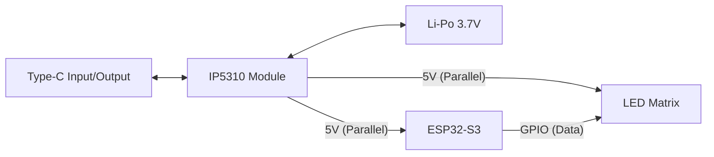

# Card-Sized 5V/3A Power & ESP32-S3 Unit — 電源構想

| 項目 | 内容 |
|---|---|
| タイムスタンプ | 2026-05-01 |
| プロジェクト名 | Card-Sized 5V/3A Power & ESP32-S3 Unit |

## コンセプト・概要

カードケースサイズに収まる薄型・高出力な電源ユニットと、ESP32-S3を統合した制御基板の開発。  
1セルLi-Po電池からIP5310を用いて、マイコンとLEDマトリクスへ安定した $5V/3A$ 供給を実現する。

## 準備物リスト

| 種別 | 品名・仕様 |
|---|---|
| 電源モジュール | IP5310搭載 Type-C 充放電一体型基板 (LX-LBC3.1) |
| マイコン | ESP32-S3-Zero または XIAO ESP32S3 |
| バッテリー | 1セル(3.7V) 薄型Li-Po電池 (503450サイズ等) |
| 出力先 | 5V駆動 LEDマトリクス (WS2812B等) |
| 配線材 | 耐熱シリコンワイヤー (AWG22/AWG28) |
| 外装 | プラスチック製カードケース |

## 主な機能

- **高出力供給:** 最大 $3.1A$ の $5V$ 出力
- **充放電管理:** USB Type-C経由の双方向充電・給電
- **バッテリー保護:** 過放電・過充電・短絡保護機能
- **LED制御:** ESP32-S3による高精度なLEDアニメーション制御

## ハードウェア仕様

### システム構成図



### ハードウェア接続

**バッテリー:**
- Li-Po (+) ━━ IP5310: **B+** (AWG22推奨)
- Li-Po (-) ━━ IP5310: **B-** (AWG22推奨)

**電源供給（並列配線）:**
- IP5310: **5V** ━━ ESP32: **5V / VIN** (AWG28)
- IP5310: **5V** ━━ LED Matrix: **5V / VCC** (AWG22推奨)

**GND（並列配線）:**
- IP5310: **GND** ━━ ESP32: **GND** (AWG28)
- IP5310: **GND** ━━ LED Matrix: **GND** (AWG22推奨)

**信号線:**
- ESP32: **GPIO** ━━ LED Matrix: **DIN**

### 各部品の役割

| 部品 | 役割 |
|---|---|
| IP5310 | 電圧変換（昇圧）およびバッテリーマネジメント |
| ESP32-S3 | システムのメインコントローラー |
| 1R0コイル | 電圧変換用インダクタ。高負荷時に発熱注意 |

## ソフトウェア仕様

- **ライブラリ:** FastLED または Adafruit_NeoPixel
- **電源管理:** ソフトウェア側での電流制限 (`setMaxPowerInVoltsAndMilliamps`)

## 開発ステップ（マイルストーン）

1. カードケース内寸と各コンポーネントの配置確認
2. IP5310とバッテリーの接続および電圧チェック
3. ESP32-S3とLEDマトリクスへの並列配線
4. 低負荷状態での動作確認
5. 3A負荷時の発熱テストとケース加工（通気孔）

## サンプルコード

```cpp
// FastLEDを用いた電流制限の例
#include <FastLED.h>
#define NUM_LEDS 64
#define DATA_PIN 4

CRGB leds[NUM_LEDS];

void setup() {
  // 5V 2500mA に制限をかける
  FastLED.setMaxPowerInVoltsAndMilliamps(5, 2500);
  FastLED.addLeds<WS2812B, DATA_PIN, GRB>(leds, NUM_LEDS);
}

void loop() {
  // LED制御ロジック
}
```

## トラブルシューティング

| 症状 | 対策 |
|---|---|
| ESP32が再起動する | 電圧降下を疑い、配線を太く短くする |
| 出力されない | IP5310は充電器に一度接続しないと起動しない（ウェイクアップ）場合がある |

## 発展のためのアイテムリスト

- 放熱用シリコンパッド
- 電圧・電流モニタリング用小型OLED
- 物理ウェイクアップ用外付けボタン

## 重要な注意点

- **並列配線の徹底:** $3A$ の大電流をESP32の基板内に流さない
- **リチウム電池の扱い:** ケース内での固定を確実にし、物理的な圧迫を避ける
- **発熱対策:** 密閉空間での連続使用時は熱暴走に注意

## 課題

- カードケースの正確な穴あけ加工
- 3A出力時の連続稼働時間の計測