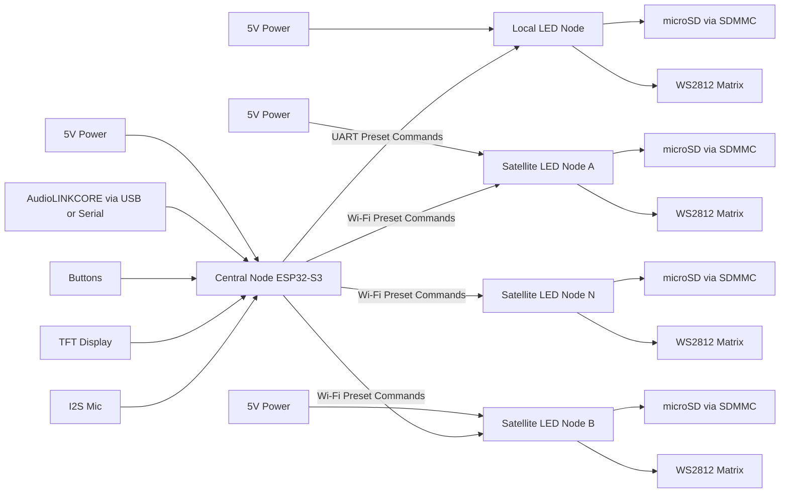

# ハードブロック図

> **最終更新**: 2026-04-xx（初版）｜**参照時点**: 2026-05-02 現在も有効

## ブロック要点

- 中央ノードは入力集約と演出配信を担当する。
- ローカル LED ノードは中央ノードと UART 直結し、同じ論理コマンドを低遅延で受ける。
- サテライト LED ノードは Wi-Fi で同じ論理コマンドを受け、microSD 上のローカルデータを参照しながら描画を行う。
- 音声データはノードへ直接配信しない。
- 大容量イルミネーションデータは各照明ノードの microSD に保持する。
