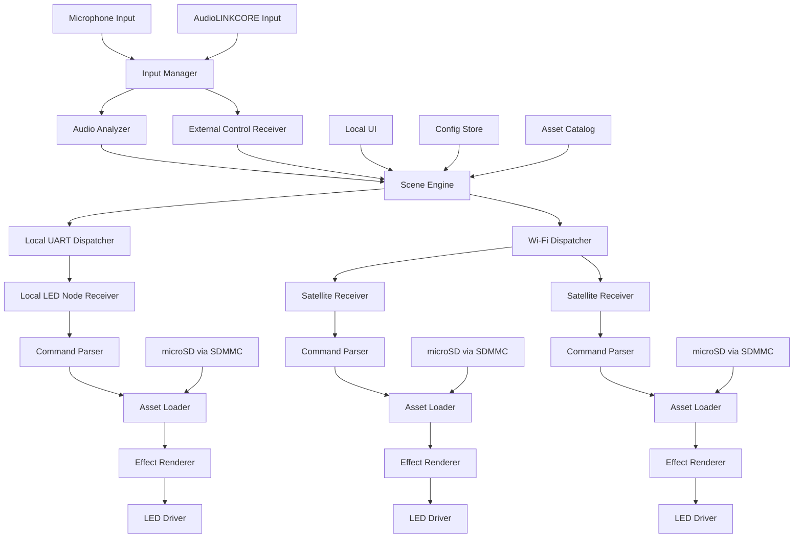

# ソフトブロック図

> **最終更新**: 2026-04-xx（初版）｜**参照時点**: 2026-05-02 現在も有効

## 設計意図

- 中央ノードは入力源を吸収して、UART と Wi-Fi の両方へ同じ論理コマンドを配る。
- 照明ノードは解析負荷を持たず、ローカル microSD 上の演出データを参照して描画する。
- 将来のサテライトノードは ESP32 と microSD を核にした共通ノード化を前提にする。
